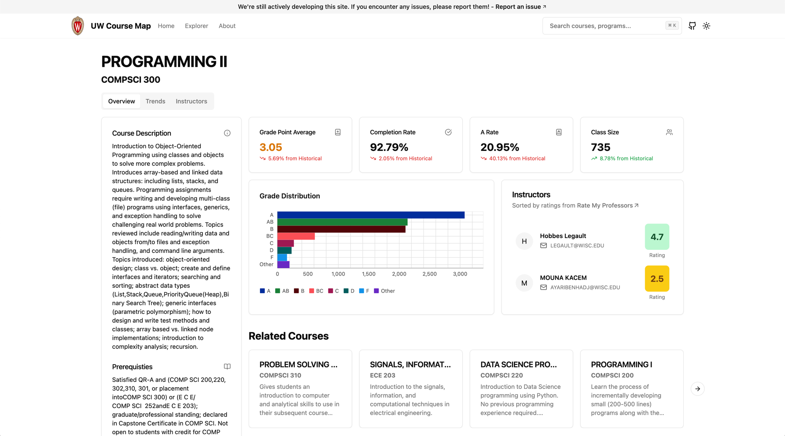

  <h1>uw-coursemap</h1>
  

    <strong>Course exploration, made easy</strong>

  

    
  

  
  
  
  

  Explore the courses offered by <a href="https://wisc.edu" target="_blank">UW-Madison</a> in a visual and interactive way.

## About

This project provides a comprehensive view of course information at the University of Wisconsin-Madison, utilizing a requirement Directed Acyclic Graph (DAG) to visualize course dependencies. The tool also offers historical grade distributions, professor ratings, and insights from Rate My Professor (RMP) comments to help students make informed decisions about their coursework.

> This project won 4th place at [Cheesehacks 2024](https://cheesehacks.webdevuw.com/) and is not affiliated with the University of Wisconsin-Madison.

### Features

- Course Requirement DAG: Displays course prerequisites and dependencies in a visual format.
- Historical Grade Distributions: Cumulative grade distributions for each course.
- Professor Ratings: Integrates data from Rate My Professor to show professor ratings and comments.
- Search Functionality: Easily search for courses, professors, and departments.

### Tech Stack
- **Frontend**: Svelte, shadcn-svelte, Tailwind CSS
- **Backend**: Python, NGINX (TODO, currently using GitHub CDN)

