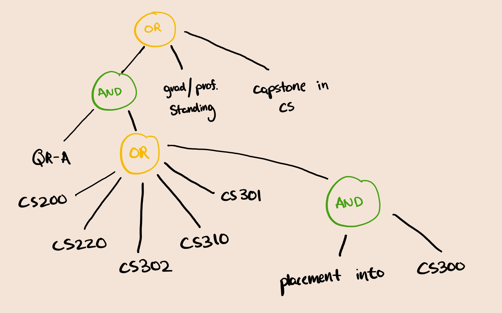
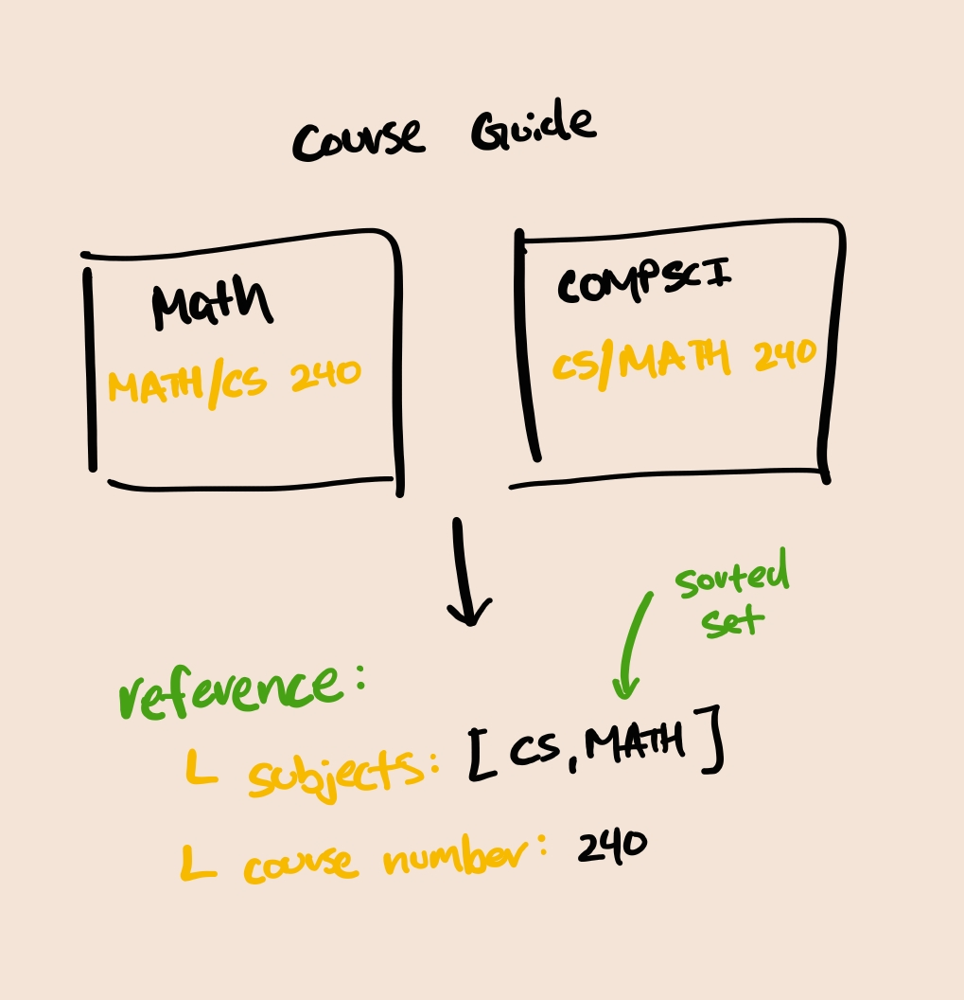
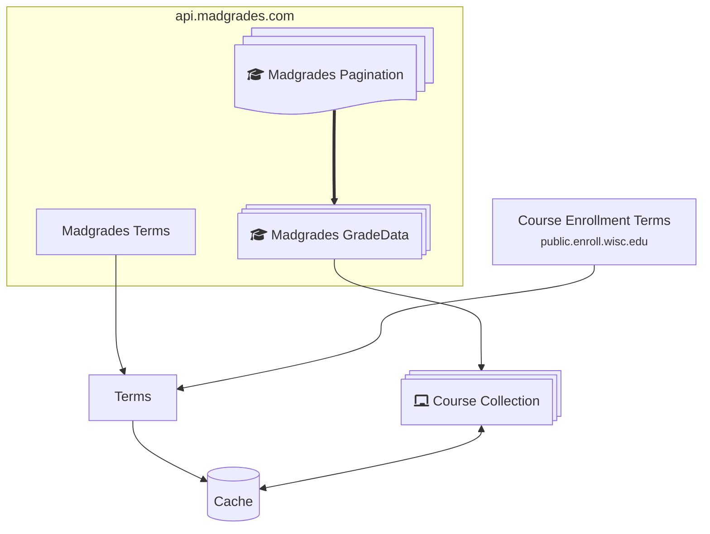
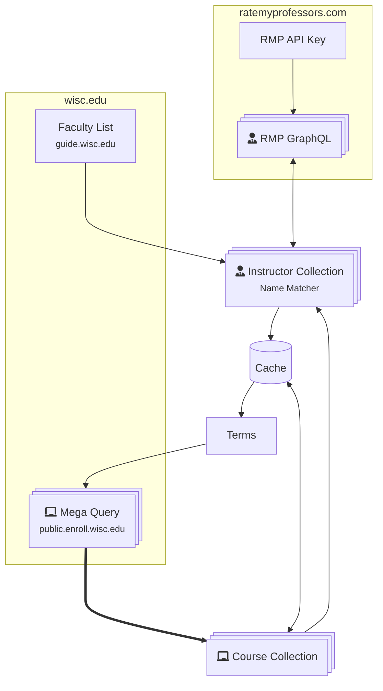
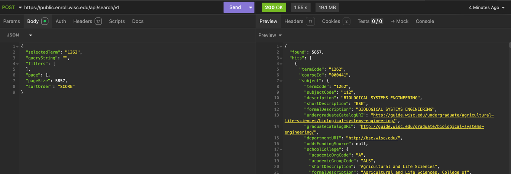
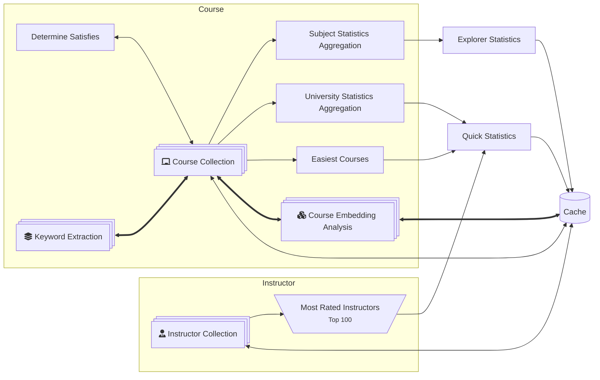
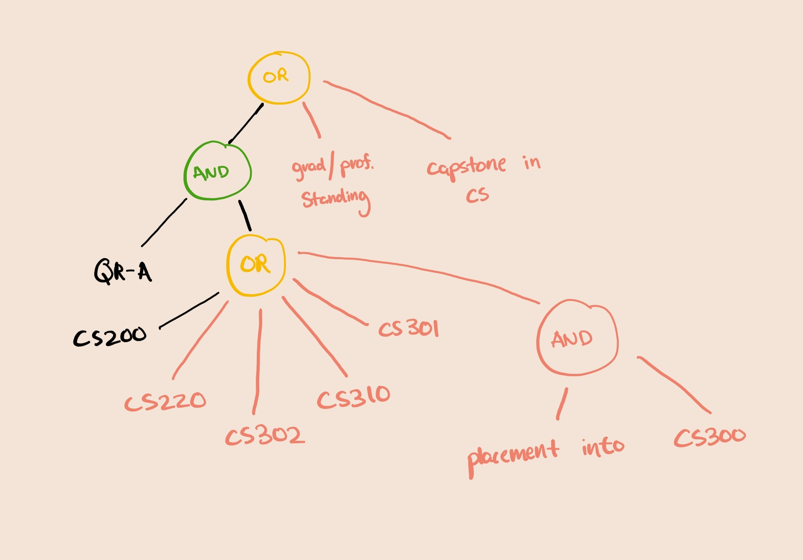
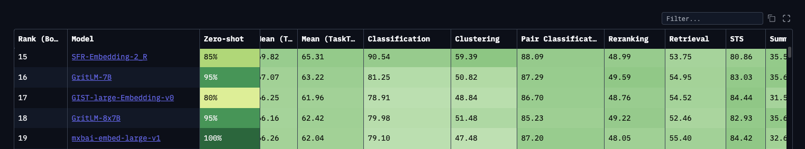
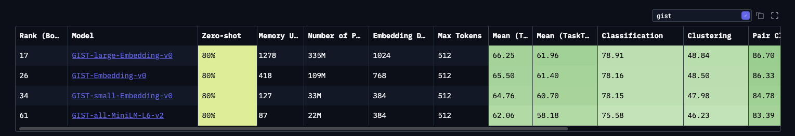
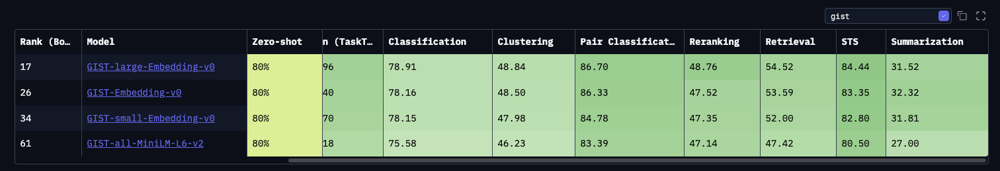

# Generation

The generation process is responsible for collecting, aggregating, and analyzing a majority of the data used in the application, including course data, professor ratings, and more.

> [!TIP] Data Science
> Since the generation process is heavily data-driven, if your interested in performing final analysis on the data, you can check out the [aggregation step](#aggregation) for more details on how the data is collected and processed.

## Process Overview

The generation process can be broken down into several key steps, as implemented in [#71](https://github.com/twangodev/uw-coursemap/pull/71); each step is responsible for a specific part of the data collection and processing pipeline.

You can specify the step to run with the `--step` flag when running the generation command. The steps are as follows:

```bash
pipenv run python generation/main.py --step <step_name>
```

Where `<step_name>` can be one of the following:

- `all`: Run all steps in order
- `courses`: Run the course collection step
- `madgrades`: Run the madgrades integration step
- `instructors`: Run the instructor collection step
- `aggregate`: Run the aggregation step
- `optimize`: Run the optimization step
- `graph`: Run the graph step

> [!TIP]
> An additional flag `-nb` or `--no_build` can be used to skip the final build step, which writes cached data to the `DATA_DIR` specified in your environment. This is recommended if you are running the individual steps for debugging or testing purposes.


This allows you to debug and test each step independently, while also providing a clear path for data flow through the process.

### Cache

Each of these steps, except for the final build step, write to a unified `.cache` directory, which is used to store intermediate results and final outputs. The final build step compiles all the data into a single output file.

Generally, the cache is platform-dependent* (it contains a models cache used for embeddings), so you should use the same cache for all steps on a single platform.

Additionally, API keys and other sensitive information may be stored in the cache, which bad actors may use, so it is recommended to keep the cache directory secure and not share it publicly.

<small>*This is a hunch, but it is likely that the cache is platform-dependent due to the models used for embeddings and other data processing steps.</small>

### Performance

Generally, this process takes 2-6 hours to run from a dry state, depending on the number of courses and instructors being processed. The time can vary based on your system's performance, network speed, and the number of courses and instructors being processed.

As a baseline, we run this process from a dry state on GitHub's CI servers, which takes roughly 3 hours. For context, public CI runners have [4 vCPUs and 16GB of RAM](https://docs.github.com/en/actions/using-github-hosted-runners/using-github-hosted-runners/about-github-hosted-runners#standard-github-hosted-runners-for-public-repositories) available, which is generally equivalent if not worse than a mid-range laptop.

With an existing cache, the process can be significantly faster. GitHub's CI servers have run the entire process in under 3 minutes with a cached state.

Therefore, during development, it is recommended to run the process with a cached state to speed up the development cycle, or run them against our existing CI pipeline. (When you submit a PR, we can manually trigger the generation process to run against your branch, if you request it in the PR description.)

## Steps

### Course Collection


To dynamically retrieve all courses offered at the University of Wisconsin-Madison, we scrape the [Guide Sitemap](https://guide.wisc.edu/sitemap.xml) to get a list of all courses and their associated departments. We filter by paths that match the pattern `/courses/...` to ensure we only collect courses, and not other types of content.

Next, we take the courses listed on each of the department pages and scrape the course.


This is also where we build our Abstract Syntax Tree (AST) for requisites.

> ##### COMPSCI 300 Requisites:
>
> Satisfied QR-A and (COMPSCI 200 , COMPSCI 220 , 302, COMPSCI 310 , 301, or placement into COMPSCI 300 ) or (COMPSCI/ECE 252 and ECE 203 ); graduate/professional standing; declared in Capstone Certificate in COMP SCI. Not open to students with credit for COMP SCI 367.
>
> 
>
> We drop branches that include a negation phrase, such as "Not open for students with..."

We also need to address issues of duplicate course listings, as some courses are listed under multiple departments.



We can use this "Reference" as a unique identifier for each course to prevent duplicates. This allows us to ensure that we only collect each course once, even if it is listed under multiple departments.

For a full reference on all schemas and their fields, they should be explained in the [Content OAS spec](../usage/static-api.md)

### Madgrades Integration



Madgrades contains historical data for all courses, including courses not currently offered. We care about the courses that we have collected in the previous step, so we scrape the Madgrades website to get the historical data for those courses. There will also be courses that are newly added to the Guide, but not yet in Madgrades.

Since Madgrades API is paginated, we need to retrieve all the pages of data for each course. From each page, we pull grade data, distribution, and other relevant information.

We additionally retrieve the terms that are available in Madgrades, and the terms that are available in the Course Enrollment Terms API. Madgrades generally will have historical terms (lagging behind the current semester), while the Course Enrollment Terms API will have the current and upcoming terms.

### Instructor Collection



The instructor collection step, admittedly, does slightly more than collect instructors. Instructor collection performs the "Mega Query."

For some reason, the Course Enrollment Terms Search API does not validate two items.

1. `queryString` is not validated, so you can pass in any string, including an empty string, and it will return all courses.
2. `pageSize` is practically not validated, so you can pass in a very large number, and it will return that many results. You cannot pass `99999999`, but you can pass in the total amount of courses in the term, which is given from the `found` field in the response.

It's a feature, not a bug! When this gets patched (if it ever does), we can just paginate through the results and do a bit of de-duplication, kind of like with Madgrades. It's fun that Madgrades, another open source project, validates requests, but UW-Madison does not 🗿.

With these two facts, we can construct a query that returns all courses in the system.



We get a hilarious amount of data, ranging from (20MB—40MB), depending on how many courses are offered in a given term.

We take all the data from Enrollment and add it within our existing course collection. This includes course information, such as the course name, description, and more.

Next, we collect the instructors for each course. We do this by scraping the [Faculty List](https://guide.wisc.edu/faculty/) page, which contains a list of all instructors at the University of Wisconsin-Madison.

The thing is, the format of the names is not consistent, and we need to match the names to the instructors in the Course Enrollment Terms API. This is handled with a name matching and diffing technique that compares the names from the Faculty List to the names in the Course Enrollment Terms API, and for the most part, it works well. You may notice issues with instructors being matched to their alternate names, but this seems like one of a couple edge cases.

We combine the data from the Faculty List and the Course Enrollment Terms API to create a unified list of instructors, which includes their names, departments, and other relevant information.

Finally, we also integrate with [Rate My Professors](https://www.ratemyprofessors.com/) to get additional data about the instructors, such as their ratings and reviews. This is done using the Rate My Professors GraphQL API, which allows us to retrieve data about instructors based on their names.

RateMyProfessors has (or had) an authenticated API, where we could send GraphQL queries to retrieve data about instructors. After some digging around, we found that the API key was provided through a JavaScript file that was loaded on the Rate My Professors website. We scrape the JavaScript file to get the production API key, which is then used to authenticate our requests to the Rate My Professors API. This in addition to modifying a couple of headers to make the request look like it is coming from a browser.

### Aggregation



Aggregation is where most of the post-processing happens. We take the data collected from the previous steps and perform various analyses to generate statistics and insights about the courses and instructors.

We perform the following analyses:

- **Quick Statistics**: This includes the number of courses, instructors, and other high-level statistics about the data collected. This generally applies to university-wide statistics, such as the number of courses offered, the number of instructors, and more. This is what you see on the [home page](https://uwcourses.com/).
- **Explorer Statistics**: This includes more detailed statistics about the courses and instructors, such as the number of courses offered by each department, the number of instructors in each department, and more. Think about this as statistics per department/subject.

> [!CAUTION]
> The API endpoints for these statistics are currently unstable and may change in the future. We are working on stabilizing them, but for now, they are subject to change without notice.
>
> You can for sure expect them to change to like, university statistics, and department statistics, but the exact endpoints and data returned may change in the future.

### Optimization

Optimization refers to the process of optimizing prerequisites. In [course collection](#course-collection), an AST is built for each course, which is then used to determine the prerequisites for each course.

Displaying all prerequisites on the explorer page can be overwhelming (and funny, since it's a massive hairball of edges). To address this, we need to prune the prerequisites.

An ideal prune for COMPSCI 300 would be:



To select a pruned AST, we use a heuristic that selects "best branch." We score branches based on a heuristic that for now, considers the semantic similarity of courses within the branch, and popularity of the courses in the branch.

$$
\begin{align}
\mathrm{scoreBranch}(c, B)
&=
\begin{cases}
0, & B = \varnothing,\\[8pt]
\alpha\,\cos\bigl(E(c),\,\overline{E}_B\bigr)\;+\;\beta\,\dfrac{n_c}{N},
& B \neq \varnothing,
\end{cases}\\
\overline{E}_B &= \displaystyle\frac{1}{\lvert B\rvert}\sum_{c'\in B}E(c'),\\
n_c &= \text{Cumulative course enrollment}\\
N &= \text{Total UW-Madison Enrollment}\\
\end{align}
$$

> [!NOTE]
> $\alpha$ and $\beta$ are currently set as 0.5 - I haven't played around with these values much, but they can be tuned to adjust the weight of the semantic similarity and popularity of the courses in the branch.
>
> Due to the nature of $\frac{n_c}{N}$, it is a really small number, so it is generally not the dominating factor in the score. It is more of a tiebreaker for branches that have similar semantic similarity scores, but probably should be tuned to be more significant in the future.
>
> If you have any suggestions on how to improve this heuristic, please open an issue or a pull request!

Before [v1.1.0](https://github.com/twangodev/uw-coursemap/releases/tag/v1.1.0), there was no AST, and we simply selected courses that semantically matched the description of the course, using OpenAI's embedding models. In [#564](https://github.com/twangodev/uw-coursemap/pull/564), we switch to [GIST Large Embedding v0](https://huggingface.co/avsolatorio/GIST-large-Embedding-v0), as it outperforms [text-embedding-3-small](https://platform.openai.com/docs/models/text-embedding-3-small), as of writing according to the [Hugging Face MTEB Leaderboard](https://huggingface.co/spaces/mteb/leaderboard) with a rank of #17:



`text-embedding-3-small` has a rank of #43:


In terms of performance, `GIST Large Embedding v0` runs locally, requiring approximately 1.2GB of memory, and performs just as fast, if not faster on most of my machines (Apple M2 Pro 16GB, HP Omen 17 i7-12700H, 32GB RAM, 3060M with CUDA enabled) (accounting for rate limiting done by OpenAI). For slower machines you can run smaller GIST models, such as [GIST Embedding v0](https://huggingface.co/avsolatorio/GIST-Embedding-v0) (rank 26), or [GIST small Embedding v0](https://huggingface.co/avsolatorio/GIST-small-Embedding-v0) (rank 34), or just the generic all miniLM-L6-v2 models by sentence transformers.



Since we are primarily using cosine similarity to evaluate which course to select, GIST should be able to perform relatively well to top models in terms of the STS and Summarization metrics.



### Graph

Graphing flattens the branch into a single list of nodes and edges, in a format compatible with Cytoscape.

We also pick colors for all the nodes here, which are then used to render the graph in the frontend. The colors are picked based on the department of the course, and gray if cross-listed.

The colors are picked to be visible on both light and dark themes with a high enough contrast ratio to be accessible.

To keep my self sane, we cache the colors for each department in the cache directory, so that colors don't change every time the graph is generated. Christmas tree graph?

### Build

This step is responsible for writing the final output to the `DATA_DIR` specified in your environment. It compiles all the data collected from the previous steps, and generates the routes for the API endpoints.

## Other Notes

### TQDM

We use [TQDM](https://tqdm.github.io/) to provide a progress bar for the generation process. This is especially useful for long-running processes, as it allows you to see the progress of the generation process in real-time. Make sure you are running generation with a TTY; otherwise the progress bar will be redrawn every time the terminal is refreshed, which can be annoying.

### CUDA

If you have a CUDA-enabled GPU, you can use it to speed up the generation process. The generation process will automatically detect if a CUDA-enabled GPU is available, and will use it to speed up the embedding generation step. This can significantly reduce the time it takes to generate the assets, especially for large datasets.

Install (replace your existing CPU dependencies) with the CUDA dependencies by:

```bash
pipenv run pip unstall torch torchvision torchaudio
pipenv run pip install torch torchvision torchaudio --index-url https://download.pytorch.org/whl/cu118 # Find out what version you actually need to use through PyTorch's website
```