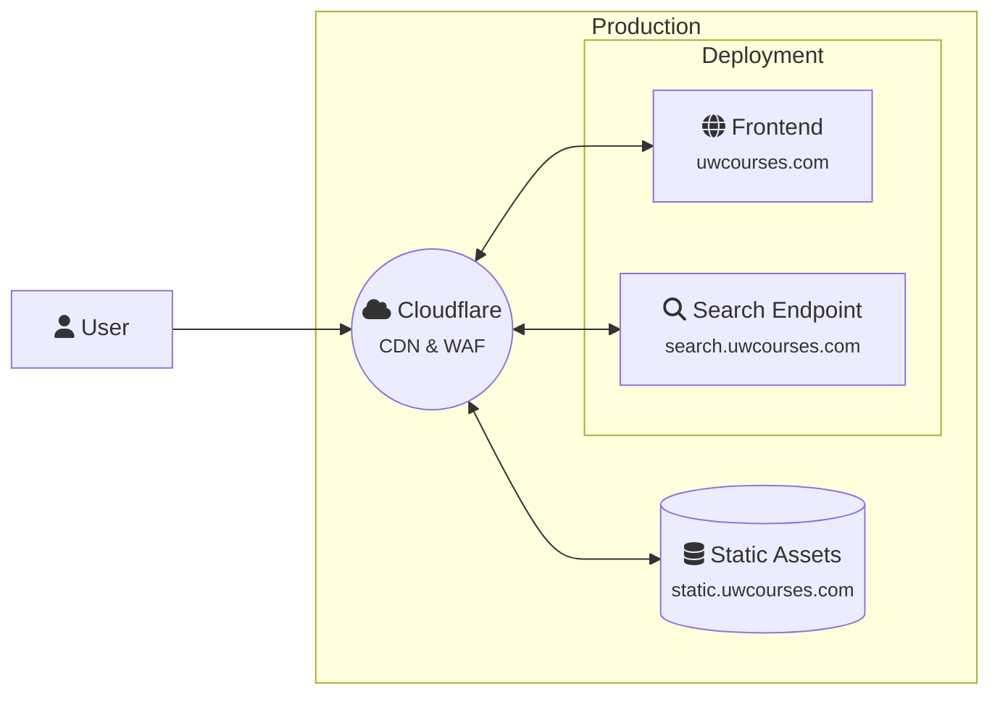

# Architecture

For the most part, there are 3 main components to the architecture:

- **Frontend**: The user interface that allows users to search for courses and view their schedules.
- **Search Server**: The backend service that handles search queries and any dynamic, unpredictable data.
- **Data Collection and Generation**: The process of collecting data from various sources and generating the static assets that are served by the frontend.

## Problem Context

We'll define the problem context by identifying the objectives, constraints, and design decisions that will guide the architecture of the system.

### Objectives

::: details Scalability
- The system should be able to handle a large number of users and data sources without performance degradation.
- If we assume 20K students (50% of UW-Madison students), each performing 5 searches per day, we need to handle 100K searches per day. We'll assume this is a peak load, and recognize that the average load will be much lower, especially during times like finals.
:::

::: details Aggregate Multiple External Data Sources
- Rate My Professor, Madgrades, Course & Enroll, and UW Course Guide each have their own rate limits and response times.
- We need a unified schema on the backend so that the front end doesn’t have to stitch together five different formats at runtime, or pull the data from each source separately.
- Ideally, we have something independent of these sources, so that one source going down doesn't take the whole site down.
  - How do we ensure we can roll back or maintain versions of the data?
:::

::: details Latency
- Fast response times are crucial for a good user experience (ideally under 500ms).
:::

::: details Public API and OSS
- Anyone should be able to use the API to build their own applications, export the data, and the code should be open source so that others can contribute and improve the project.
:::

### Constraints

::: details My wallet is empty
This one is self-explanatory, womp womp.
:::

::: details Bandwidth
Common cloud hosting providers offer charge for bandwidth per GB, which can add up quickly with a large number of users. This doesn't scale well with users/abuse, so we need to be careful about how we handle this.
:::

### Design Decisions

::: details Microservice Architecture
To answer scalability concerns, we will use a microservices architecture with a focus on stateless services that can be scaled horizontally. 

Why no Vercel? It's good platform to just get started; unfortunately, my wallet does not scale to meet my personal expectations for this project.
:::

::: details Use of Docker
Docker will be used to containerize the application, allowing for easy deployment and scaling. This also allows us to run the application on any platform that supports Docker, making it easier to develop and test locally.

If we need to scale to multiple instances, we can use Docker Swarm or Kubernetes to orchestrate the containers. This will allow us to run multiple instances of the frontend and search servers to handle more traffic.

<small>"it's just a container, bro"</small>
:::

::: details Cloudflare
Cloudflare will be used as a CDN and WAF to protect the application from DDoS attacks and other security threats. This will also help to reduce latency by caching static assets and serving them from the edge.

Bandwidth isn't really a concern with Cloudflare, commonly hit assets should end up living on Cloudflare's edge, reducing actual bandwidth from our origin servers.

I also have other projects that use Cloudflare, so this is a convenient way to manage all of my projects in one place.
:::

::: details Static Assets
We'll keep static assets (data, images, etc.) to isolate them from the rest of the application. This will allow us to serve them from a separate domain, where we can use more aggressive caching and reduce the load on the main application server. If it's really an issue, we can also just yeet data into an S3/R2 bucket and serve it from there, but I don't think we'll need to do that.

We'll use git to version control the static assets, and deploy them to a separate domain (e.g. `static.uwcourses.com`) that is served by GitHub Pages. GitHub pages has a soft limit of 100GB/month bandwidth, which should be sufficient for our needs, especially with Cloudflare caching the assets. You also get to export the data directly from the repository, which is a nice bonus.

Git gets angry handling so many files (30K+) and their diffs, escpecially when the files are generated in a non-deterministic manner. There's still some optimizations to the generation, but haven't gotten around to fixing it. 

The data is in a seperate repository, referenced by a submodule in the main repository. This allows us to keep the static assets separate from the rest of the application, while still being able to version control them.

I'll admit that this a part of the project I'm not entirely happy with, but it works for now. Another alternative is just serving assets via a web server like NGINX or Caddy.
:::

## Deployment Architecture

From the [system context](#system-context), we can derive the following deployment architecture:

For deployment, I have a A1-Flex instance (4 OCPU, 24GB RAM) on [Oracle Cloud](https://www.oracle.com/cloud/free/) that runs the frontend and search servers. Bandwidth is free for the first 10TB/month, which is more than enough for our needs. The instance is running Oracle Linux 8, and the application is deployed using Docker Compose along a couple other of my projects.

Since the static data is served independly from a versioned deployment, we can update the static assets without having to redeploy the entire application. This allows us to make changes to the data without affecting the rest of the application, and also allows us to roll back to a previous version of the data if needed.

This also comes with a downside of creating breaking changes to the data model, which will require a new version of the static assets to be generated and deployed on the live API. This is something we'll need to consider when creating new data models or making changes to existing ones, but for the most part we can avoid this by being careful with our changes and ensuring that they are backwards compatible.

## CI/CD Pipelines

We have 4 main CI/CD pipelines running on GitHub Actions:

- **Docker Build**: This pipeline builds the Docker images for the frontend and search servers, and pushes them to the GitHub Container Registry (GHCR) and Docker Hub.
- **Static Assets Generation**: This pipeline generates the static assets from the data sources, and pushes them to the static assets repository.
- **Node.js Build**: This pipeline builds, tests, and lints the SvelteKit frontend.
- **Docs Build**: This pipeline builds the documentation using Vitepress, and allows you to see what your looking at right now.

## Monitoring

To monitor our static API, we define routes in Cloudflare that records endpoint health. Since most of the API is behind [Fastly](https://www.fastly.com/), requests take approximately 100-200ms to respond.

Cloudflare also has a whole suite of monitoring tools that we can use to track the performance of our application, including analytics, logs, and alerts.

For analytics on the main application, I have it connected to my self hosted Rybbit instance, which is an open source, no-cookie analytics platform, similiar to [Umami](https://umami.is/). This allows me to track user interactions with the application, such as page views, clicks, and searches, without using cookies or tracking users across the web.

I was using Umami in the past, but Rybbit has cool visuals - who doesn't like that? If you'd like to see the current analytics, you can view them at [rybbit.twango.dev](https://rybbit.twango.dev/1). The instance is public, but you can only view the analytics, not modify them.