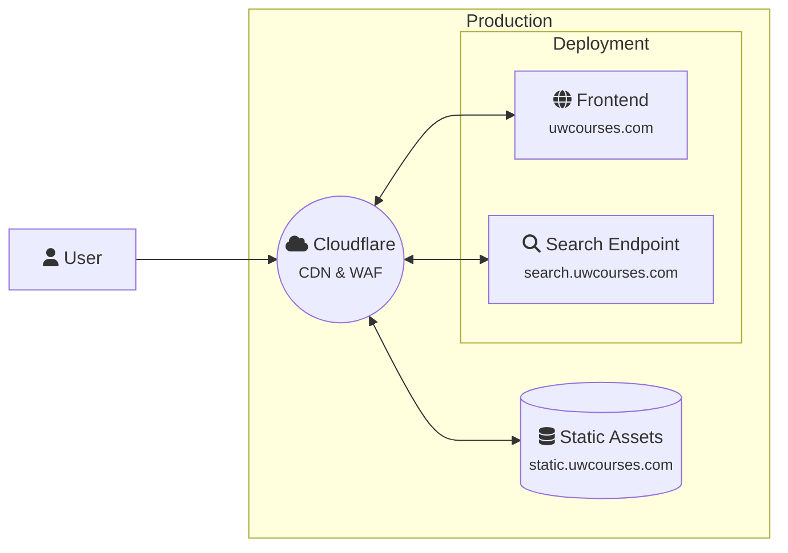
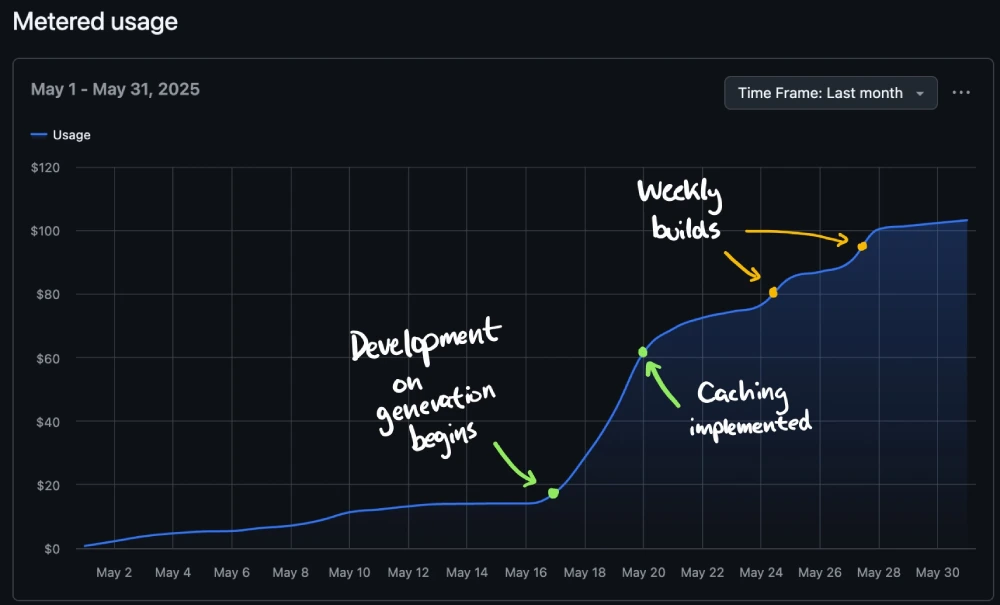
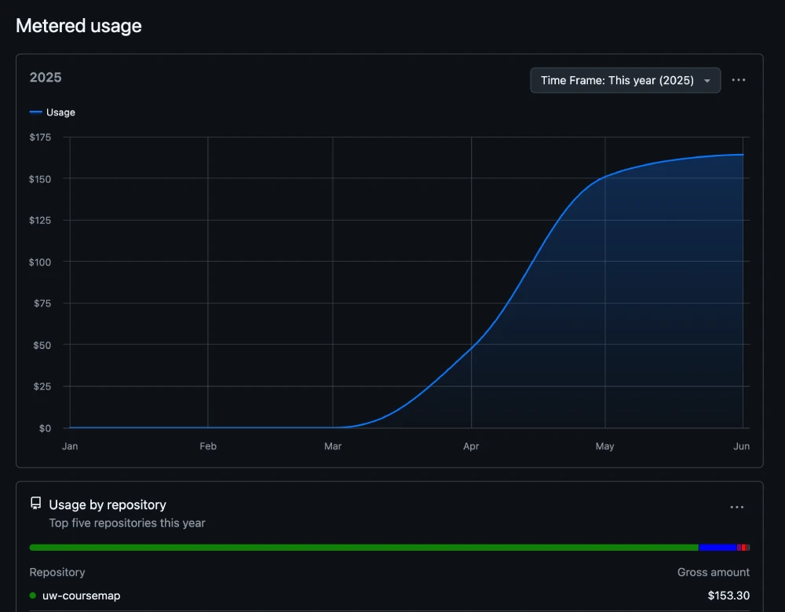
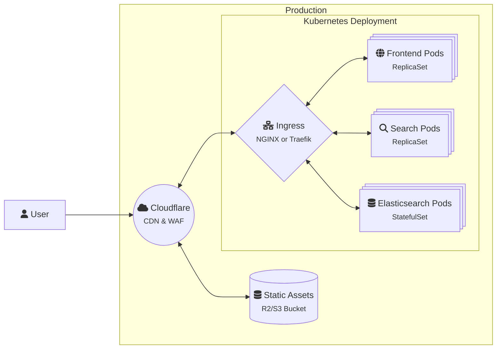

# Architecture

[UW Course Map](https://uwcourses.com) follows the [microservice architecture pattern](https://en.wikipedia.org/wiki/Microservices), where each service is responsible for a specific part of the application. This allows us to isolate services from each other, scale them independently, and deploy updates without affecting the entire application.

- **Frontend**: The SvelteKit application that serves the user interface. SvelteKit configured to use the static assets as a data source, which allows us to build the application without needing a backend server. 
- **Backend**: A Flask service that serves data which cannot be determined at build time, such as search queries. Currently, this service is responsible for:
  - Handling search queries and returning results from the Elasticsearch index.
  - Generating random courses for the "Random Course" feature.
- **Static Assets**: A set of static JSON files that contain the data for the application, generated from a Python script.

> [!IMPORTANT] Current Scale/Stats*
> - **600+ peak daily active users**, with an average of ~100 daily active users
> - **150K+ peak requests** within a day, with an average of **~100K requests per day**. Within a single month, we have seen over **3M+ requests**.
> - Approximately **~75GB of data served per month**.
> 
> <small>*Updated as of June 2025</small>

## Deployment Architecture

Currently, the application is deployed on a single [A1-Flex (4 OCPU, 24GB RAM) instance](https://www.oracle.com/cloud/compute/arm/), alongside other projects.

::: details No Vercel?
No, we do not use Vercel for deployment. My wallet does not scale to meet Vercel's pricing.
::: 

::: details Why are static assets separate from the deployment?
Since the static assets are served independently relative to the deployment, we can update the static assets without needing to redeploy the entire application. This allows us to update the data without downtime, and also makes it easier to scale the application. We also do not need to release "versions" of data.

However, this comes with the downside of being able to make breaking changes to the static assets without updating the frontend. To mitigate this, we'll try our best to maintain backwards compatibility with the API, and in the cases where it is required, we will give 1–2 weeks notice before rolling out breaking changes.

In case users must use an older version of the static assets, all assets are version controlled. Users can still access older versions of the static assets, either with jsDeliver, or by downloading the assets directly from the GitHub repository and self-hosting.
::: 

### CI/CD Pipelines

To automate the deployment process and ensure code changes are tested before being deployed, we use [GitHub Actions](https://github.com/twangodev/uw-coursemap/actions) for our CI/CD pipelines. The pipelines are defined in the `.github/workflows` directory.

### Optimization

To bring this application to production, not only do we have to design for scale, but we also have to optimize the application for performance and cost. This is especially important given that the application is open source and free to use (and because my wallet does not scale :().

#### Aggressive External Caching

To optimize performance, we leverage aggressive caching strategies. In early builds, we used [jsDelivr](https://www.jsdelivr.com/) to serve static assets. However, the initial load time for assets was really slow, and it was hard to control what assets were actually cached.

By switching to Cloudflare, we were able to significantly reduce the load time for static assets. Cloudflare caches the assets at the edge, which means that users can access the assets from a location closer to them, reducing latency and improving load times. Currently, about 70% of the assets result in a cache hit from Cloudflare, giving users less than 100 ms load times for the static assets.

Currently, Cloudflare is configured to cache endpoints on `static.uwcourses.com` for 5 days, and assets are also served with a 5 day cache TTL.

An added bonus of using Cloudflare is international accessibility, approximately 10-20% of users are from outside the United States, and Cloudflare's global CDN allows us to serve assets to users in other countries with minimal latency.

#### Generation Caching

Generating all static assets for this application was by far one of the most time-consuming tasks (and in theory, most expensive). Before [#622](https://github.com/twangodev/uw-coursemap/pull/622) and other caching PRs, assets were generated on every run, which often took 3–4 hours to complete. This was not ideal, as it meant that every time we made a change to generation, we had to wait for the entire generation process to complete before we could see the changes.

To mitigate this, we implemented caching strategies that allow us to speed up responses from APIs, use diffing techniques to only update changed data, and save large model downloads. This allows us to significantly reduce the time it takes to generate the assets, from 3 to 4 hours to about 10–15 minutes. This is a significant improvement-it allows us to iterate on the generation process much faster, and reduces load on the services used during generation.

By reducing the time it takes to generate the assets, we can also reduce the cost of running the application.

As you can see, after caching was implemented (May), the cost of running the actions dropped significantly, from about $100 to about $15 per month. This is a significant reduction in cost, and it allows us to run the generation process more frequently.

> [!TIP]
> GitHub Actions is free for public repositories, so there was no "real" cost to us (scary $150 bill), aside from the time it took to run the actions. This also improves the developer experience, as we can now run the generation process locally without having to wait for hours for the assets to be generated.

<small>We talk more about the generation process in the [generation](../codebase/generation.md) documentation, if that interests you.</small>

### Scale

Even with the current demand, the application does not warrant the need to horizontally scale. We'll see how the application performs as we continue to grow, especially during enrollment periods, but for now, the single instance is enough to handle the load.

In practice though, here's what the deployment could look like if we scaled with Kubernetes:

## Monitoring

To monitor our static API, we define routes in Cloudflare that records endpoint health. Since most of the API is behind [Fastly](https://www.fastly.com/), requests take approximately 100-200ms to respond.

Cloudflare also has a whole suite of monitoring tools that we can use to track the performance of our application, including analytics, logs, and alerts.

Additionally, we use [rybbit](https://github.com/rybbit-io/rybbit) to monitor user interactions with the application. This allows us to track how users are using the application, popular content, referrals, and more. This data is used to improve the application and provide a better user experience, while protecting user privacy. If you'd like to take a look at the data we collect, you can view it on our [rybbit dashboard](https://rybbit.twango.dev/1)